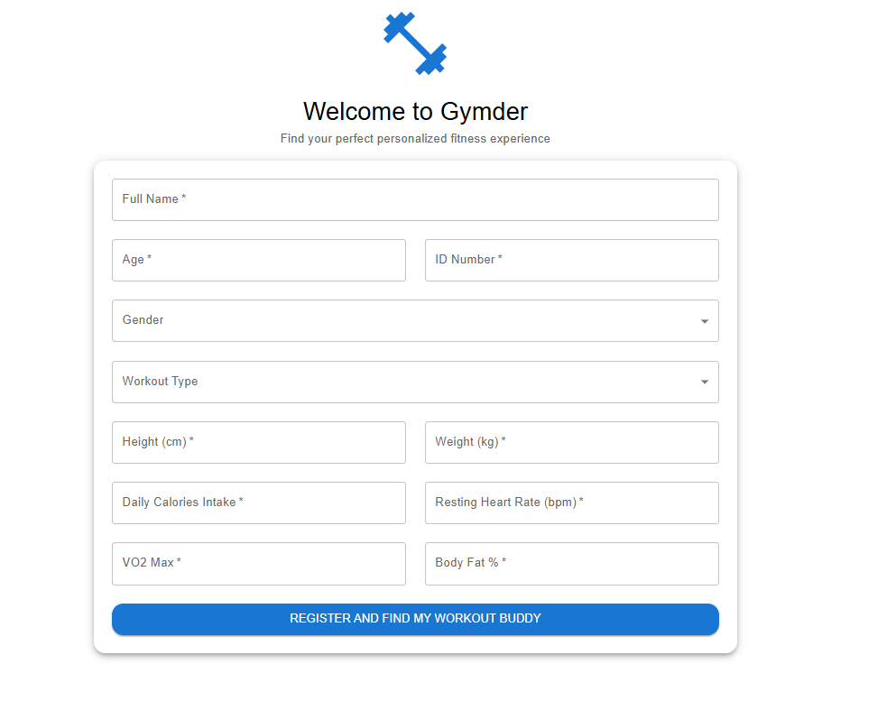
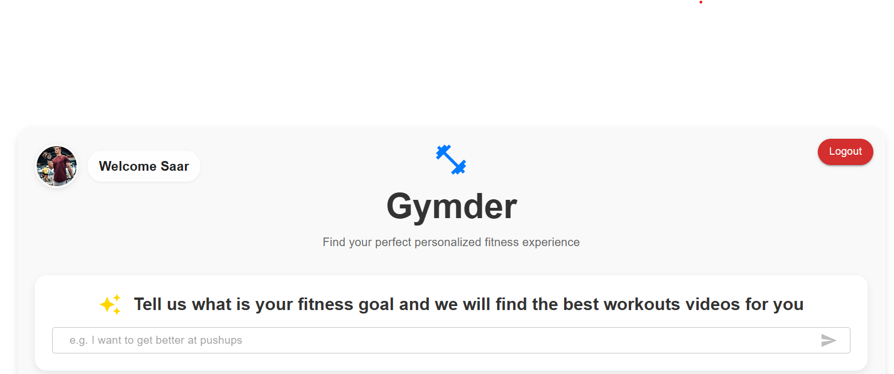
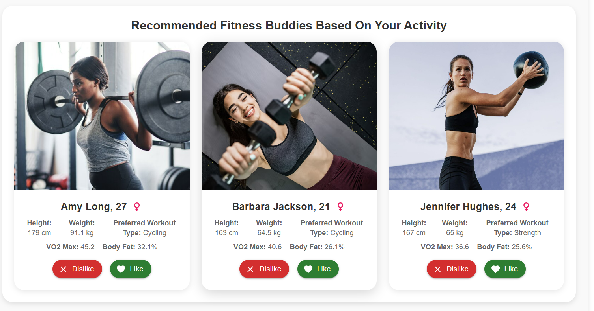
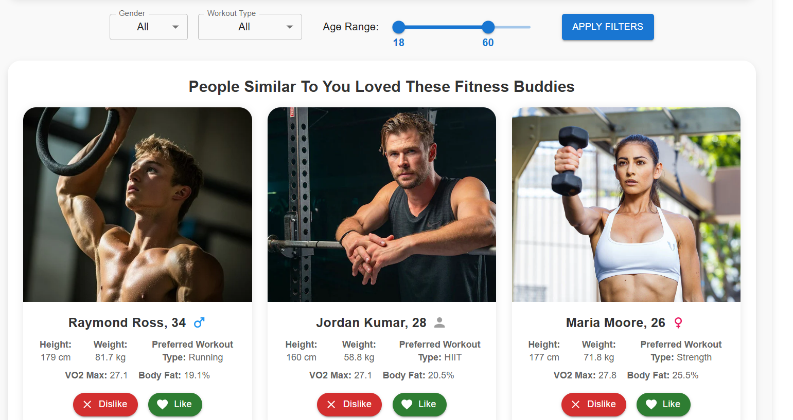

# Gymder - AI-Powered Fitness Buddy Recommendation System

A personalized fitness recommendation system that connects users with compatible workout buddies and provides AI-powered workout video recommendations. The system uses advanced machine learning algorithms including K-NN, SVD, XGBoost reranking, and LLM integration to deliver highly personalized fitness experiences.

&nbsp; 
## Documentation

You can find all the documentation in the following files:

- [Installation Guide](install.md)
- [Project Summary](summary.md)
- [Modules Description](modules.md)

&nbsp; 
## About

This project is developed for the *Recommender Systems Workshop* at Tel Aviv University.  
More information can be found on the [Workshop Website](https://courses.cs.tau.ac.il/recsys/).

### Authors

- Almog Haviv - almoghaviv@mail.tau.ac.il 
- Nir Anchel - niranchel@mail.tau.ac.il
- Saar Molina - saarmolina@mail.tau.ac.il
- Tal Cohen - tal9@mail.tau.ac.il

&nbsp;

## Screenshots

Here are screenshots of the application interface:

### Login Page

### Create New Account

### Logo and Text Box For Describing Fitness Goal

### LLM YouTube Exercises Results

### SVD Recommendations 

### XGBoost Reranker Recommendations 

