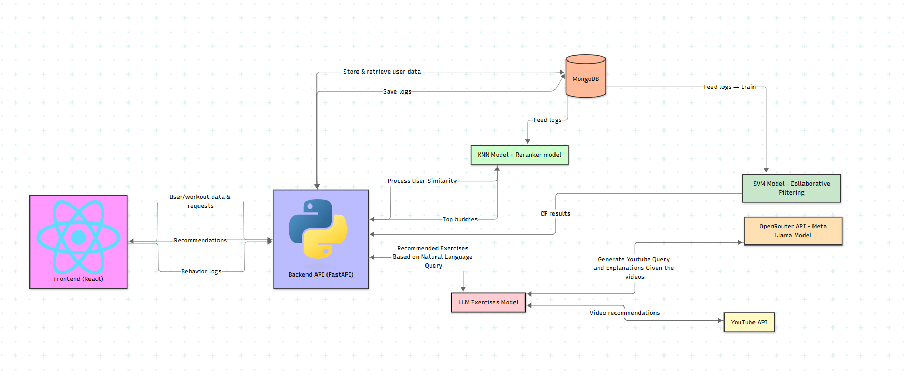

# Modules Description

## User Interface (Frontend)

- **Technology**: React with TypeScript, Material-UI (MUI), React Router DOM
- **Responsibilities**: Display user interface, collect user inputs, handle navigation between pages
- **Interactions**: 
  - Calls backend APIs for user registration, login, and data retrieval
  - Receives and displays fitness buddy recommendations and workout suggestions
  - Sends user interactions (likes/dislikes) to backend for logging
  - Handles user profile creation and fitness goal queries
- **Key Features**: 
  - User registration and login pages
  - Main dashboard with buddy recommendations and filters
  - Workout recommendation page with AI-powered video suggestions
  - Responsive design with Material-UI components
- **Source code**: [`frontend/src/`](./frontend/src/)

## Backend API Server

- **Technology**: FastAPI, Uvicorn, Pydantic, CORS middleware
- **Responsibilities**: Expose REST APIs, orchestrate requests between modules, handle data validation
- **Interactions**: 
  - Handles all frontend requests for user management, recommendations, and workout data
  - Dispatches requests to recommendation engines, database, and external APIs
  - Manages user authentication and session handling
  - Coordinates between different ML models and data sources
- **Key Endpoints**: 
  - User registration and profile management (`/users`)
  - Buddy recommendations (`/similar-users-reranked`, `/recommend-buddies`)
  - Workout recommendations (`/best-workout-recommendation`)
  - Event logging (`/log-event`)
- **Source code**: [`backend/app/api/`](./backend/app/)

## Database Layer

- **Technology**: MongoDB , PyMongo
- **Responsibilities**: Store and retrieve user profiles, workout data, and interaction logs
- **Interactions**: 
  - Provides data to recommendation engines for model training
  - Stores user interactions for feedback collection and model improvement
  - Maintains user profiles and workout preferences
  - Supports real-time data access for recommendation generation
- **Collections**: 
  - `users`: User profiles with fitness metrics
  - `workout`: Workout preferences and logs
  - `events`: User interaction logs (likes/dislikes)
- **Source code**: [`backend/app/database.py`](./backend/app/database.py)

## Content-Based Recommendation Engine (K-NN)

- **Technology**: scikit-learn K-Nearest Neighbors, NumPy, Pandas
- **Responsibilities**: Find physiologically similar users based on fitness characteristics
- **Interactions**: 
  - Receives user profile data from backend
  - Processes fitness metrics (age, gender, height, weight, VO2_max, etc.)
  - Provides input to XGBoost reranker for hybrid recommendations
- **Features**: 
  - Separate models for male/other and female users
  - Euclidean distance with feature weighting
  - Real-time filtering by age, gender, and workout type
- **Source code**: [`backend/models_training_pipeline/knn/`](./backend/models_training_pipeline/knn/)

## Collaborative Filtering Engine (SVD)

- **Technology**: scikit-learn SVD decomposition, PyTorch for matrix factorization
- **Responsibilities**: Discover latent user-buddy preferences from interaction patterns
- **Interactions**: 
  - Uses user-buddy interaction matrix (likes/dislikes)
  - Generates user and buddy embeddings (20 latent factors)
  - Provides collaborative filtering recommendations
  - Works alongside content-based filtering for hybrid approach
- **Source code**: [`backend/models_training_pipeline/svd/`](./backend/models_training_pipeline/svd/)

## Hybrid Reranker (XGBoost)

- **Technology**: XGBoost, scikit-learn RandomizedSearchCV
- **Responsibilities**: Rerank and optimize recommendations using advanced features
- **Interactions**: 
  - Receives candidates from K-NN content-based filtering
  - Combines multiple signals (compatibility, workout type matching, interaction patterns)
  - Returns optimized ranking of fitness buddies
  - Uses hyperparameter tuning for optimal performance
- **Features**: 
  - Compatibility scoring
  - Workout type preference matching
  - Contextual preference analysis
  - Real-time feature engineering
- **Source code**: [`backend/models_training_pipeline/xgboosting/`](./backend/models_training_pipeline/xgboosting/)

## AI-Powered Workout Recommendation Engine

- **Technology**: OpenRouter API (meta-llama/llama-3.1-8b-instruct), YouTube Data API 
- **Responsibilities**: Generate personalized workout video recommendations using natural language processing
- **Interactions**: 
  - Receives fitness goal queries from frontend
  - Enhances user queries using LLM for better YouTube search
  - Analyzes video content and generates personalized explanations
  - Returns curated workout videos with equipment requirements
- **Features**: 
  - Natural language query understanding
  - Smart query enhancement for video discovery
- **Source code**: [`backend/models_training_pipeline/llm_workout_recs/`](./backend/models_training_pipeline/llm_workout_recs/)

## Data Processing Pipeline

- **Technology**: Pandas, NumPy, scikit-learn preprocessing
- **Responsibilities**: Preprocess and enrich user data, generate synthetic interactions
- **Interactions**: 
  - Enhances original dataset with BMI and body fat calculations
  - Generates 750,000 synthetic user-buddy interactions
  - Provides feature engineering for ML models
  - Supports model training and evaluation
- **Features**: 
  - Feature scaling and normalization
  - Gender encoding and categorical processing
  - Interaction generation using compatibility scoring
  - Data validation and quality checks
- **Source code**: [`backend/models_training_pipeline/interaction_cration/`](./backend/models_training_pipeline/interaction_cration/)

## Model Training and Evaluation

- **Technology**: scikit-learn, XGBoost, custom evaluation metrics
- **Responsibilities**: Train, evaluate, and optimize recommendation models
- **Interactions**: 
  - Trains models on user data and interactions
  - Evaluates performance using NDCG, precision, recall, and ROC-AUC
  - Optimizes hyperparameters using cross-validation
  - Saves trained models for production use
- **Evaluation Metrics**: 
  - NDCG@K for ranking quality
  - Precision/Recall for classification performance
  - ROC-AUC for model discrimination
  - F1-Score for balanced performance
- **Source code**: [`backend/models_training_pipeline/`](./backend/models_training_pipeline/)
